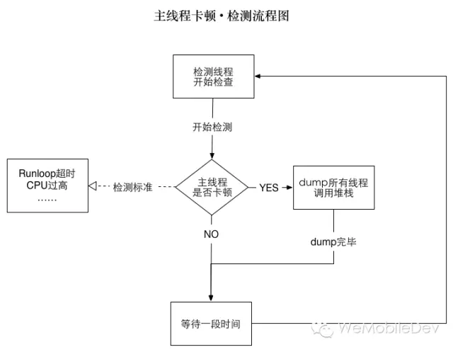

# 性能监控

## 监控参数

### 帧率 FPS

`CADisplayLink - representing a timer bound to the display vsync.`
监听`CADisplayLink`后，每次 vsync 发生时，会收到一个回调。
记录每次回调，大于1s时Label中显示 回调次数/时间差。

### CPU

>iOS 是基于 Apple Darwin 内核，由 kernel、XNU 和 Runtime 组成，而 XNU 是 Darwin 的内核，它是“X is not UNIX”的缩写，是一个混合内核，由 Mach 微内核和 BSD 组成。Mach 内核是轻量级的平台，只能完成操作系统最基本的职责，比如：进程和线程、虚拟内存管理、任务调度、进程通信和消息传递机制。其他的工作，例如文件操作和设备访问，都由 BSD 层实现。

- `task_info` 获取 `task_info_data_t`
- `task_threads` 获取 `thread_array_t`
- `thread_info` 获取 `thread_info_t`
- `thread_basic_info_t` 获取 `cpu_usage`

### 内存 Mem

- `task_info`  - `mach_task_basic_info`
- `mach_task_basic_info` - `resident_size`

### 卡顿

#### 微信检测流程策略

1. 判断标准
    - CPU 占用超过 100%
    - 主线程 Runloop 执行超过了2秒
2. 检测策略
    - 内存 dump：每1秒检查一次，如果检查到主线程卡顿，就将所有线程的函数调用堆栈 dump 到内存中。
    - 文件 dump：如果内存 dump 的堆栈跟上次捕捉到的不一样，则 dump 到文件中；否则按照斐波那契数列将检查时间递增（1，1，2，3，5，8…）直到没有遇到卡顿或卡顿堆栈不一样。这样能够避免同一个卡顿写入多个文件的情况，也能避免检测线程围着同一个卡顿空转的情况。
3. 分类方法
    - 最外层归类：能够将同一入口的卡顿归类起来。缺点是层数不好定，可能外面十来层都是系统调用，也有可能第一层就是微信的函数了。
    - 中间层归类：能够根据事先划分好的“特征值”来归类。缺点是“特征值”不好定，如果要做到自动学习生成的话，对后台分析系统要求太高了。
    - 最内层归类：能够将同一原因的卡顿归类起来。缺点是同一分类可能包含不同的业务。
4. 可运营
    - 抽样上报：每天抽取不同的用户进行上报，抽样概率是5%。
    - 文件上传：被抽中的用户1天仅上传前20个堆栈文件，并且每次上报会进行多文件压缩上传。
    - 白名单：对于需要跟进问题的用户，可以在后台配置白名单，强制上报。
    - 为了减少对用户存储空间的影响，卡顿文件仅保存最近7天的记录，过期删除。

#### 实际策略 (只用于debug模式)

流程与微信一致，只使用子线程检查

- 流程：子线程BOOL，主线程修改，0.1s睡眠后，如果BOOL未被修改，打印信息。
- 打印内容
    - 时间、CPU、内存、FPS
    - 主线程堆栈
    - 所有线程堆栈
- 堆栈打印
    - NSThread -> thread_t ：task_threads -> thread_array -> thread_t -> pthread_t -> NSThread
 

### 耗电

IOKit 私有API获取电量

- `IOServiceAddInterestNotification`
- `IORegistryEntryCreateCFProperties`

参数

- DesignCapacity 总电量
- CurrentCapacity 当前电量

消耗电量 / 时间 = 平均耗电

比较优化前后的 `平均耗电` 即可得出优化率

## 统计

0.5s 显示一次。记录 - 平均

## 附： 堆栈获取

### 原理

- `调用栈`：它是每个线程独享的一种数据结构，分为若干栈帧(stack frame)
- `栈帧`由三部分组成:函数参数，返回地址，帧内的变量。
- `返回地址`：表示当前函数执行完后跳转到继续执行的地址（代表的是__text section 的函数地址）
- `Stack Pointer(栈指针)`表示当前栈的顶部，由于大部分操作系统的栈向下生长，它其实是栈地址的最小值。
- `Frame Pointer` 指向的地址中，存储了上一次 `Stack Pointer` 的值，也就是`返回地址`。
- 每个栈帧还保存了上一个栈帧的 `Frame Pointer`
- 只要知道当前栈帧的 `Stack Pointer` 和 `Frame Pointer`，就能知道上一个栈帧的 `Stack Pointer` 和 `Frame Pointer`，从而递归的获取栈底的帧。

### 具体实现

#### 调用栈地址

- NSThread -> thread_t
    - task_threads -> thread_array `task_threads`
    - 遍历 thread_array -> thread_t
    - thread_t -> pthread_t  `pthread_from_mach_thread_np`
    - pthread_t -> NSThread `pthread_getname_np`
- thread_t -> _STRUCT_MCONTEXT (machineContext) `thread_get_state`
    - machineContext 中包含线程信息
        - 包含 `Frame Pointer`
        - `Frame Pointer` 包含前一个 `Frame Pointer`
- _STRUCT_MCONTEXT -> framePointer
- 递归调用即可获得调用栈虚拟内存地址

#### 地址与符号的映射

- `dladdr()` address -> Dl_info
- `Dl_info` 包含image名、符号名
- address -> imageIndex
    - 获取 image 索引数量 `_dyld_image_count()`
    - 遍历 image 索引
    - 获取 `mach_header`, `_dyld_get_image_header()`
    - 获取 image 虚拟内存地址偏移 `_dyld_get_image_vmaddr_slide()`
    - 遍历 `mach_header` 中的所有 `load_command`
    - 获取其中的 `segment_command`, `load_command->cmd == LC_SEGMENT`
    - 如果 image 虚拟内存地址偏移在 `segment_command` 的 `vmaddr ~ vmaddr+vmsize`区间中，返回当前遍历的索引, 即为 imageIndex

- imageIndex -> imageName `_dyld_get_image_name()`

- address -> imageOffset
    - get imageBase `_dyld_get_image_vmaddr_slide()`
    - get segmentBase
        - 获取 `mach_header`, `_dyld_get_image_header()`
        - segmentOffset = SEG_LINKEDIT->vmaddr - SEG_LINKEDIT->fileoff (相当于 SEG_TEXT 的虚拟内存基地址)
        - segmentBase = segmentOffset + imageBase
    - get imageOffset = address - imageBase

- mach_header + segmentBase -> Symbol Name + Offset
    - get symtab_command `load_Commmand->cmd == LC_SYMTAB`
    - get __symbolTable__ `(struct nlist*)segmentBase + symtab_command->symoff`
    - get __stringTable__ `segmentBase + symtabCmd->stroff`
    - traverse symbolTable get symbol_value_ptr `symbolTable->n_value`
    - get Symbol Name `stringTable + symbol_value_ptr->n_strx`

## 参考文章

[Wedjat开发过程的调研和整理](https://aozhimin.github.io/iOS-Monitor-Platform/)

[微信iOS卡顿监控系统](https://mp.weixin.qq.com/s/M6r7NIk-s8Q-TOaHzXFNAw)

[获取任意线程调用栈](https://bestswifter.com/callstack/)